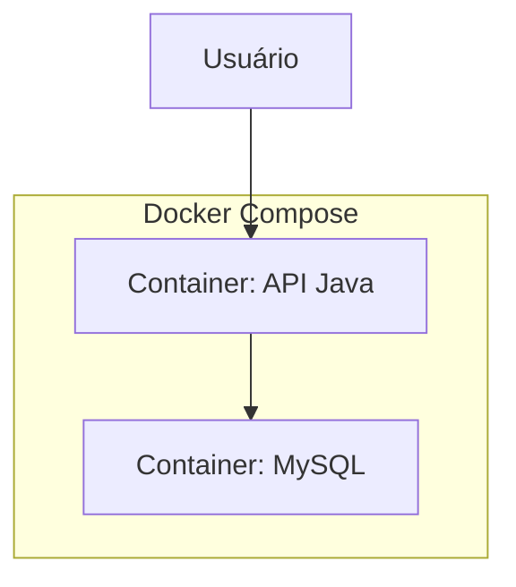

# FindMyPet API - Docker Compose

## 🚀 Como rodar
```bash
docker compose up -d --build
```

## 🔑 Serviços
- **API Java**: http://localhost:8080  
- **Banco MySQL**: localhost:3306  

## 📂 Comandos úteis
- `docker compose ps` → ver containers  
- `docker compose logs -f app` → logs da API  
- `docker compose down -v` → remover containers + volumes  

## 📦 Deploy passo a passo
1. Clone o repositório.  
2. Configure variáveis de ambiente no `docker-compose.yml`.  
3. Rode `docker compose up -d`.  
4. Teste CRUD via Postman ou browser.  

## 🛠 Troubleshooting
- **Erro de conexão DB** → Verifique usuário/senha e se o `db` está rodando.  
- **API não sobe** → Checar logs com `docker compose logs -f app`.  

## 📊 Arquitetura

### Arquitetura Atual
```mermaid
graph TD
    A[Usuário] --> B[Aplicação Java (local)]
    B --> C[Banco de Dados (instalado na máquina)]
```

### Arquitetura Futura

